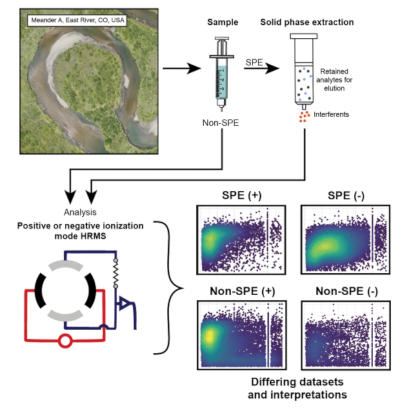

# FTICR-Methods-Comparison
 
The suite of scripts used in to perform the analyses outlined in the manuscript "Implications of sample treatment on riverine environmental metabolome characterization using FTICR-MS."  
 
<b>File descriptions:</b> 
EastRiver_Comparison_Stats.R - This script performs the statistical analysis of the FTICR data files listed in the processed files zip folder 
KEGG_API_FTICR_Mapping.R - This script will map the molecular formulas detected in a given dataset to the compound lists found using the KEGG API using HTML scraping. The resulting files from this mapping are stored in the processed files zip folder under their respective condition (e.g., "_Pathways_from_Compounds.txt"). 
KEGG_Pathway_Analysis.R - This script will take the data generated from "KEGG_API_FTICR_Mapping.R" 
Processed FTICR Data Files.zip - Zip folder containing all of the processed data from this study (e.g., assigned formulas, NOSC calculations, other DOM measurments).
